# Bread Dog Bot

此项目基于 Nonebot2 和 go-cqhttp 开发，一个高度可自定义化的Terraria TShock Bot。

## 声明

此项目仅用于学习交流，请勿用于非法用途

## Nonebot2
非常 [ NICE ](https://github.com/nonebot/nonebot2) 的OneBot框架

## 功能

### 基础功能
+ 添加服务器
+ 删除服务器
+ 重置服务器列表
+ 服务器列表
+ 在线
+ 执行
+ 发送

### 绑定功能
+ 白名单列表
+ 添加白名单
+ 删除白名单
+ 重置白名单列表

### 管理功能
+ 管理员列表
+ 添加管理员
+ 删除管理员

## 安装

### Windows

#### 下载懒人包

从[发布页面](https://github.com/Qianyiovo/bread_dog_bot/releases)下载最新版本

解压下载的压缩包

打开解压后的文件夹
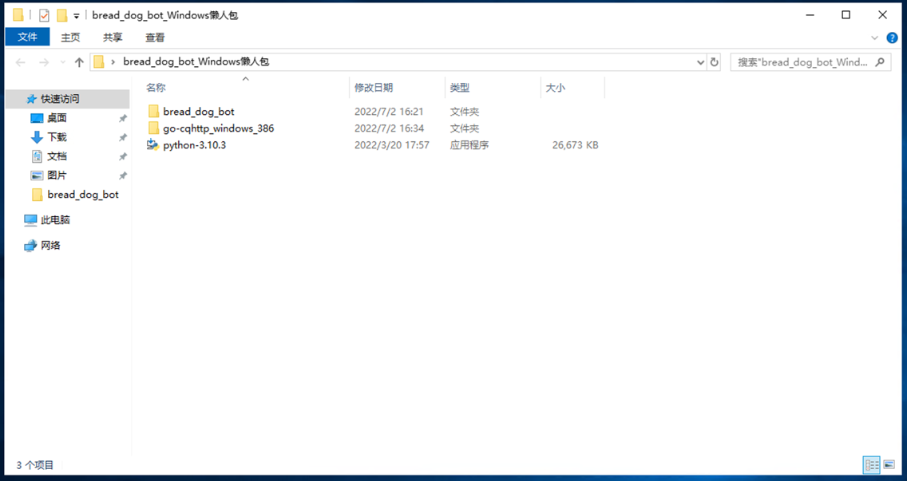
+ bread_dog_bot 机器人主程序
+ go-cqhttp_windows_386 go-cqhttp用于登入QQ
+ python-3.10.3.exe Python环境安装器

#### 安装Python 环境

双击打开 python-3.10.3.exe
勾选 Add Python 3.10 to PATH
点击 Install Now 开始安装Python环境
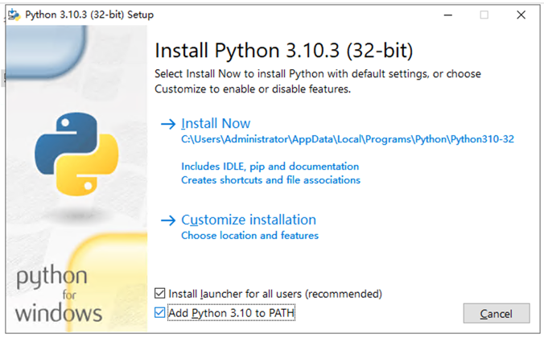
Python环境安装完成
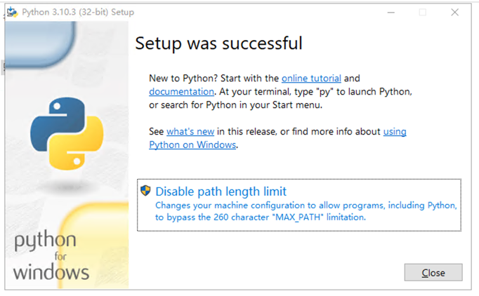

#### 初始化环境
双击打开 bread_dog_bot 文件夹中的 初始化.bat
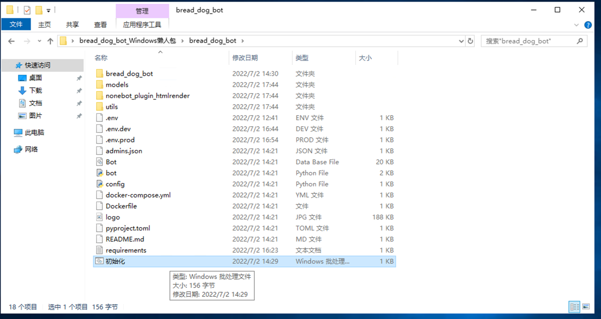
耐心等待初始化完成
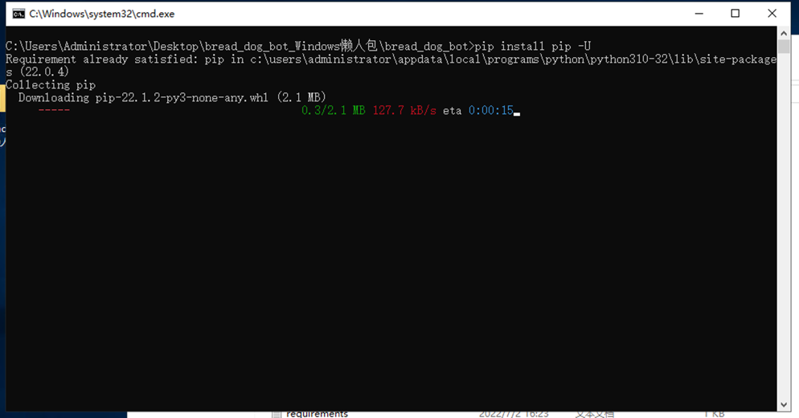
如果出现以下图片的情况
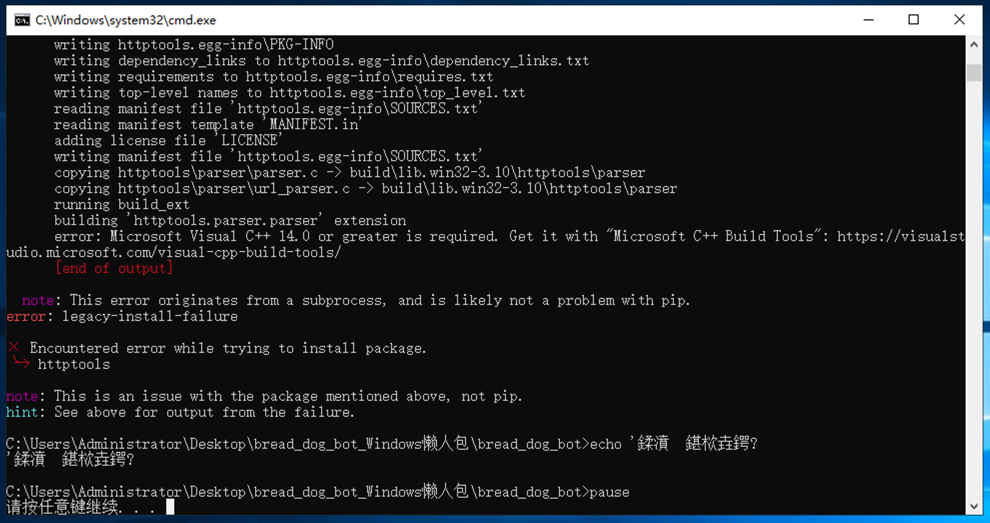
就说明系统缺少必要依赖（visual C++ build tool)

如果安装成功 贼会显示以下图片的情况
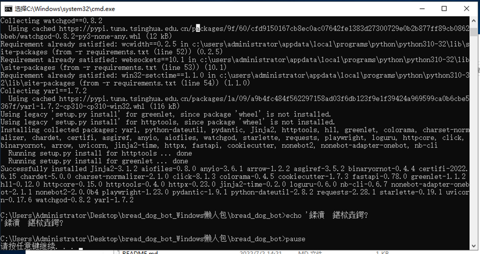

##### 安装依赖(visual C++ build tool)
第一次安装99%都会出现这个情况

如果没有出现过以上图片的情况可跳过这一步

由于文件过大 导致无法上传 大概有1.2G(为什么那么大)

可前往QQ群：772721898 下载文件或直链下载

依赖：www.miaovps.com/solved_packageMissInInstalling_mu_visual_cpp_build_tools_2015_update_3_x64_dvd_dfd9a39c.iso

双击打开下载好的iso文件

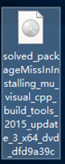

双击打开 VisualCppBuildTool_Full.exe
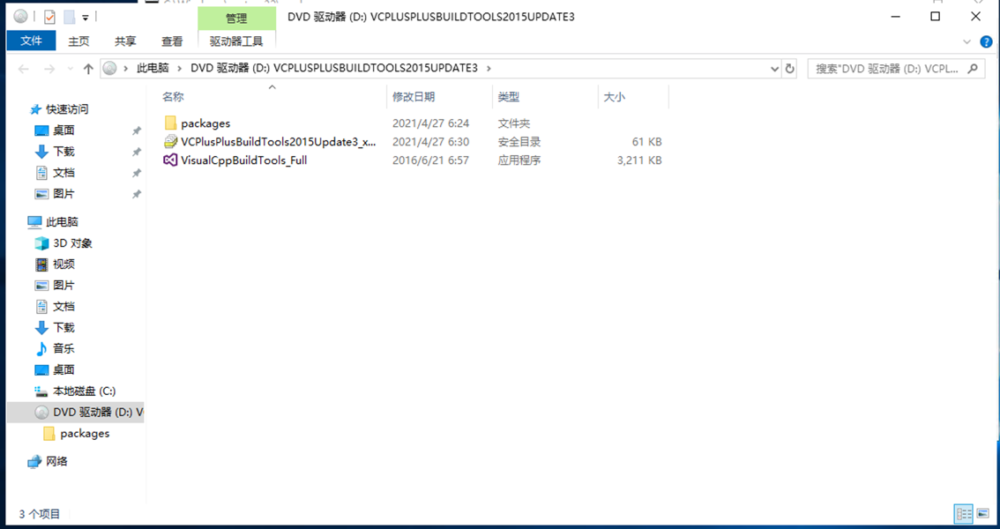

耐心等待加载
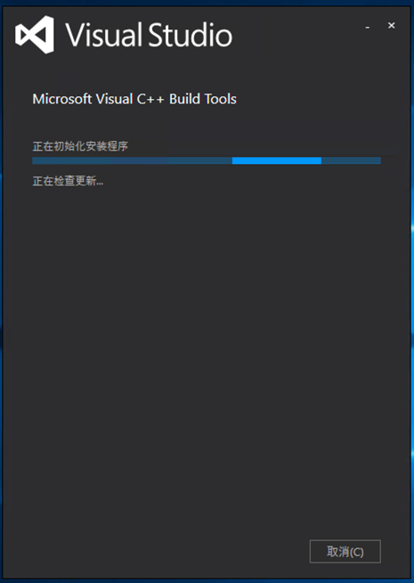
加载完成后

点击 安装
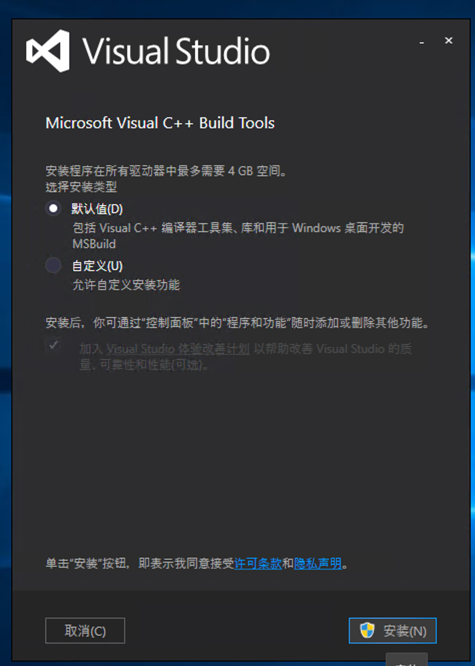

等待安装完成
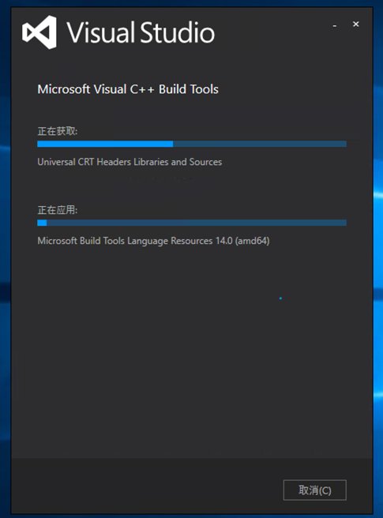

安装完成
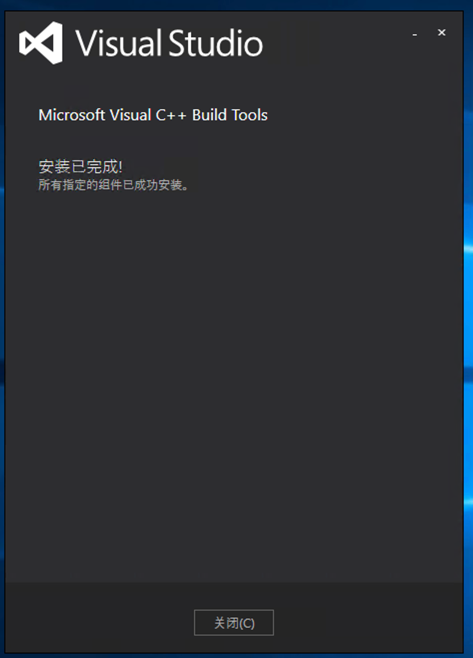

重复 初始化环境 步骤 重新初始化环境

出现以下图片的情况说明安装成功

环境安装到此结束

#### 登入cq-http

双击打开 go-cqhttp_windows_386 文件夹中的 go-cqhttp.bat

不是 go-cqhttp.exe！

不是 go-cqhttp.exe！！

不是 go-cqhttp.exe！！！

重要事情说三遍！！！！！
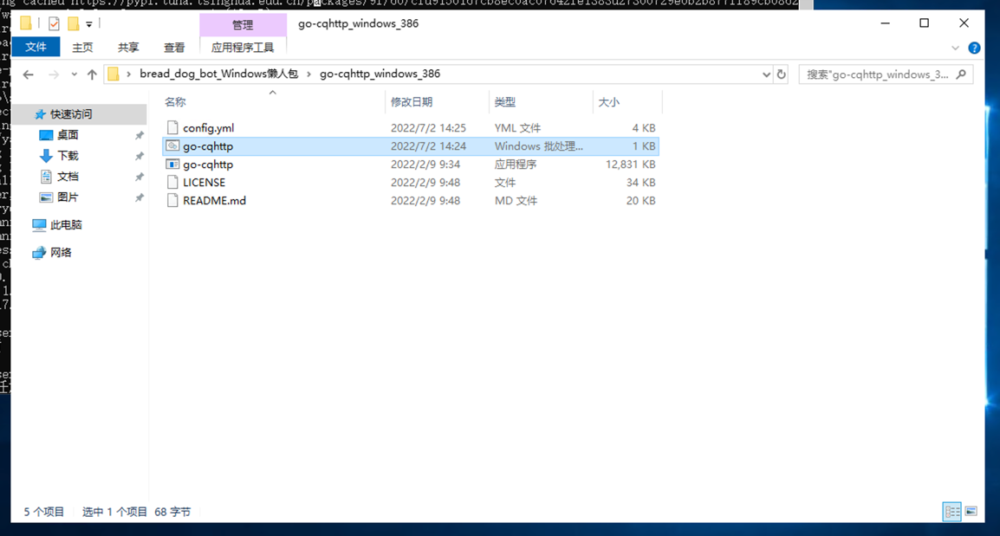
扫描并登入QQ
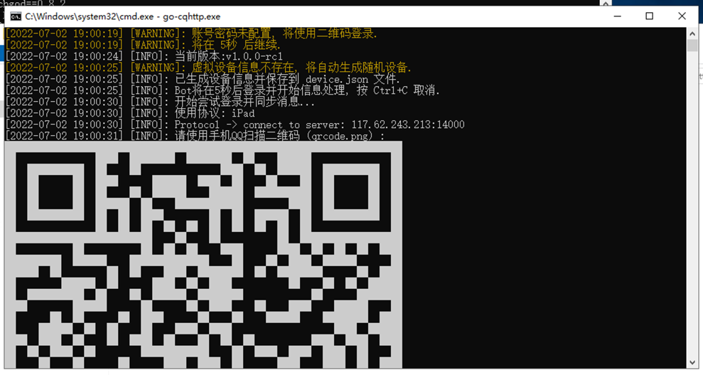
为什么无法登入？
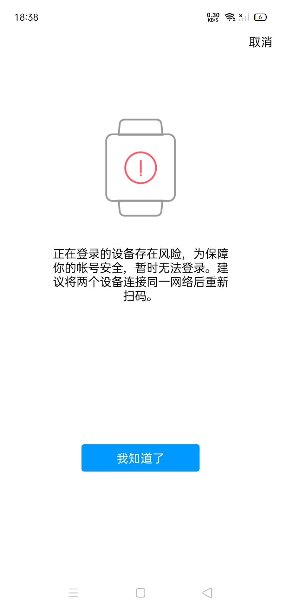
别急，这是腾讯的安全检测，你需要在本地中登入cq-http

##### 本地登入cq-http
把cq-http-windows-386文件夹复制到本地

也就是复制到你的电脑上去
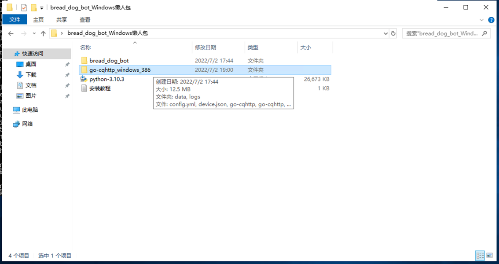

复制到本地后双击打开 cq-http-windows-386 文件夹中的 cq-http.bat

然后扫描二维码登入QQ

就不会出现安全检测了

登入后目录下会生成两个文件

分别是 device.json 和 session.token
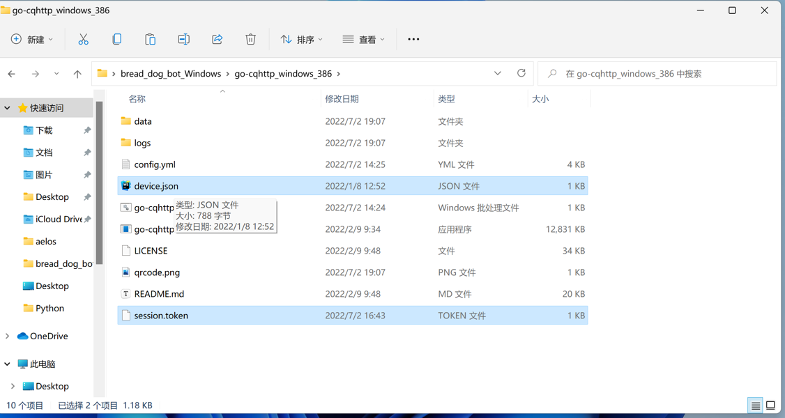

把这两个文件复制到服务器上的cq-http文件夹中
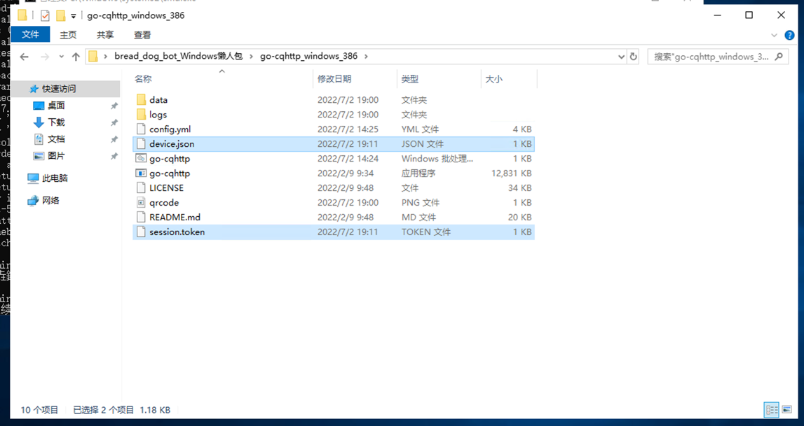

双击打开 go-cqhttp.bat
出现以下情况就说明登入成功
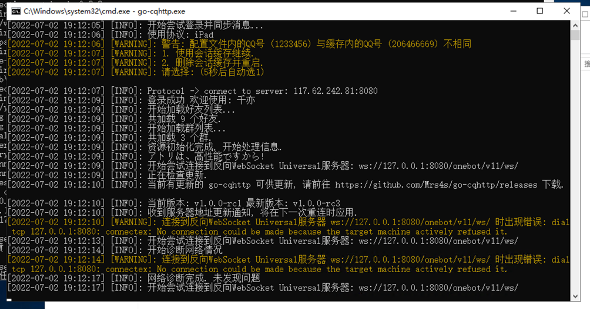

#### 启动机器人

双击打开 bread_dog_bot 文件夹中的 bot.py

第一次启动需要安装Chromium

请耐心等待安装完成
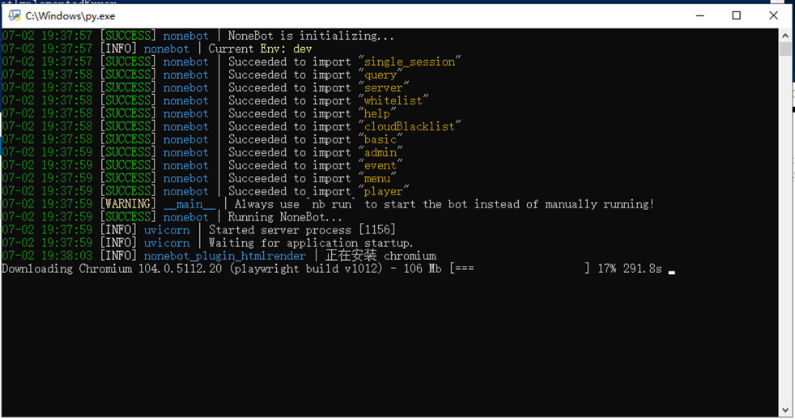

## Q&A

## 更新
2002/07/7(v1.2.0)
+ 修复绑定白名单后再次绑定出现返回消息错误
+ 修复部分功能服务器列表无服务器时不发送任何消息
+ 新增许多玩家功能（签到、添加\扣除\删除金币）
+ 新增wiki [@ACaiCat](https://github.com/ACaiCat)
+ 放弃使用HTMLRender，故删除了一些功能（白名单列表、管理员列表），后续更新中会以其他方式重新加入

2022/07/02(v1.1.0)

+ 重写了所有功能，设计变得更加合理了。